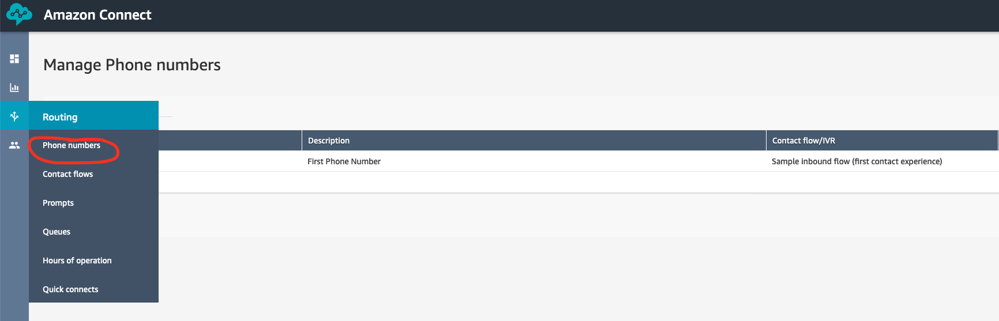
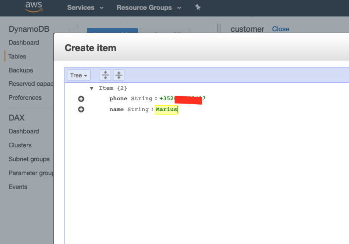
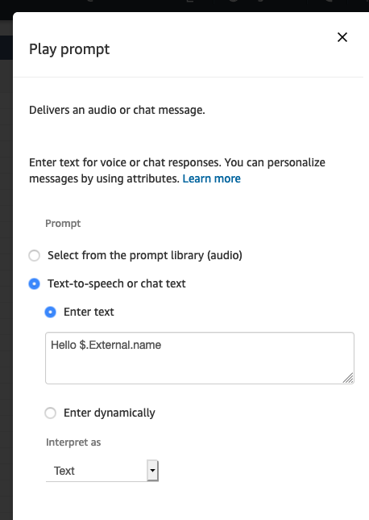
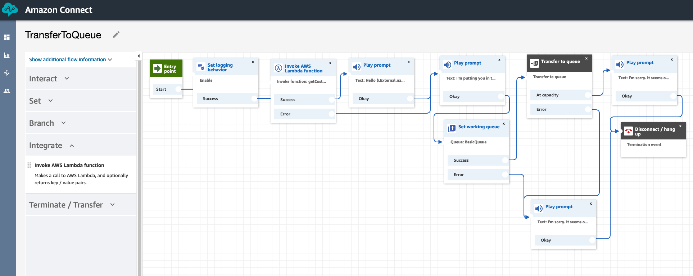

# 1. Intro to Amazon Connect

## What are we going to build?
1. A working instance of Connect
2. A voiced IVR flow that will recognize incoming calls, offer personalized greetings and adapt based on user interaction history.

## What services are we going to use?
1. Connect as the Contact Center solution and backbone for the other services
2. A DynamoDB table to store user information 
3. Lambda functions to store and retrieve user information
4. S3 to store conversation data and call metadata
5. Cloudwatch to monitor and debug the solution
6. Polly to voice IVR dialogue
7. (optional) Lex for basic chatbot functionality

## Prepare the Environment (if not already done)

### Launch an Amazon Connect instance
1. Log into the console.
2. Navigate to the Amazon Connect service page.
3. Select Add an instance
4. For identity management, choose Store users within Amazon Connect and enter a unique url to serve as an access point for your Contact center. Click Next.
   1. For production applications, it may make more sense to integrate with an existing directory, but for the purposes of today, let's use the built in user management capabilities.
5. For Create an Administrator page, add an admin identity.  You can use your IAM user to authenticate as an admin into the instance if you do not create a separate entity. Click Next.
6. For Telephony Options, make sure both incoming and outbound calls are selected. Click Next.
7. For Data storage, leave the default settings. Click Next.
8. Review and Create the instance.
9. Once the instance is created, select Get Started.


# 2. Getting Started with Amazon Connect

1. Access the instance.
   1. Navigate to the Amazon Connect access URL
   2. Connect with the Username and Password for the admin account.
2. Once you&#39;ve entered the Amazon Connect application, select &quot;Let&#39;s go&quot;.
3. Claim your phone number. The country should be the same as where your billing address is. Select Direct Dial number and click Next.


5. Wait a minute or so.  
6. Give yourself a call! Amazon Connect comes with a number of example contact flows to demonstrate different functionalities.
(Optional) Choose 1 > 1 > 1 in the IVR to get transfered to an agent and make the web client ring!


# 3. Create your first Contact Flow


1. Under Routing, select Contact Flows.
2. Select create contact flow.
3. Enter the name TransferToQueue.
4. Under Interact, add a Play prompt module and link it to Entry point.
5. Click into the module, select Text to speech and enter the text &quot;I&#39;m putting you in the queue&quot;.
6. Under Set, add a Set working queue module and link it to the Play prompt module.
7. Click into the module and select the BasicQueue.


8. Under Terminate/Transfer add a Transfer to Queue module and link it to the Success option of the Set working queue module.
9. Add two more Play prompt modules. Make one say &quot;Something went wrong. Try again later&quot; and the other &quot;I&#39;m sorry. It seems our queue is at capacity. Try again later&quot;.
10. Link the error message to the Error options on set working queue, Transfer to Queue, and the at capacity message.
11. Under Terminate/Transfer, add a Disconnect/Hang up module and link your final messages to it.
12. Save and then publish.
13. Under Routing > Phone numbers, select the number you&#39;ve claimed.



14. Under Contact flow / IVR, select the TransferToQueue contact flow you just created and save.

### Test it out!

1. Open up the CCP by clicking the phone icon in the upper right hand corner.


2. Wait a few moments and give yourself a call.
3. Notice that when a customer is put into a queue, they are really put into the Default customer queue.  If you want to change the experience, you can.  You can also build things like interruptible queue flows.  Similarly, the agent (you) heard the Default agent whisper.  Whispers are used to share information to only one side of the conversation.

# 4. Building a personalized greeting - Integrating AWS Lambda and DynamoDB

We will use DynamoDB table and store our name and telephone number. For every call, a Lambda function will lookup the calling number in the table and, if found, will return the name. We will use Polly to greet the caller by name.  

### Creating the DynamoDB table

1. Log into the Amazon console.
2. Navigate to Services > DynamoDB
3. Click 'Create Table'. Name the table "customers" and use a "phone" field as the primary key.


4. Click Create.



5. Create a new item. Add your phone number and a "name" field of String type. Fill in your name.
The phone number should contain the country code (e.g. +352691997777)

### Creating an IAM role used by Lambda to access DynamoDB

1. Log into the Amazon console.
2. Navigate to Services > IAM > Roles
3. Click Create Role
4. Choose AWS Service as the type of trusted entity and Lambda as the use case. 
5. Click Next: Permissions
6. Search for and select AmazonDynamoDBFullAccess. Click Next.
7. Enter a name (e.g. "ConnectDDBLambdaRole") and click Create Role.


### Creating the getCustomer Lambda

1. Log into the Amazon console.
2. Navigate to Services > Lambda
3. Click Create Function. If you have never used Lambda, you will get a slightly different get started screen - in this case, select Author from scratch.
4. Enter a name. Select Python 3.7 as the runtime. For permissions, use an existing role and select the role you created during the previous step. Click Create.
5. Navigate to the Function Code section and paste the following code:

```python
import boto3

def lambda_handler(event, context):

    dynamodb = boto3.resource('dynamodb')

    table = dynamodb.Table('customers')

    response = table.get_item(Key={'phone':event['Details']['ContactData']['CustomerEndpoint']['Address']})

    return response['Item']
```
6. Click Save.

### Granting permissions for Lambda in Connect

1. Log into the Amazon console.
2. Navigate to Services > Connect. Select your Connect instance.
3. Select Contact Flows
4. Scroll down to the Lambda section and add the getCustomer function you just created. Make sure to click +Add Lambda Function!

### Update the flow

1. Log into the Connect dashboard.
2. Navigate to Routing > Flows and open TransferToQueue
3. Under Set, find the Set Logging Behavior and insert it right after the Start block.
4. Under Integrate, find the Invoke AWS Lambda Function and insert it after the Logging behavior. Click the block and select the getCustomers Lambda and increase the timeout to 8 seconds. If you cannot see the Lambda, make sure you granted the correct permissions as instructed in the previous section.



5. Add another Play block after the Invoke Lambda block. In the Text to speech section add "Hello $.External.name". Link the success endpoint of the Lambda block to the new Play block. Link the error endpoint to the following Play block.



6. Click Publish.
7. Wait a couple of minutes and give yourself another call. You should not be greeted by name!.
8. If you do not receive the greeting, you can troubleshoot your flow using CloudWatch logs! Navigate to Services > CloudWatch > Logs > Log Groups > (aws/connect/(yourConnectInstanceName).

### Using Amazon Lex as a Conversational Router


1. Create a new contact flow called InboundLexRouter.
2. Under Interact, add a Get customer input module. Add a Text to speech prompt. &quot;Would you like to wait on hold or be called back later when we are ready to serve you?&quot; Select Amazon Lex and the ConnectBot in the account. Add WaitOnHold, CallBack, and Emergency as Intents.
3. Create an error flow.
4. Under Terminate/Transfer, select Transfer to flow. Select your InboundCallRouter contact flow and save. Link this to the WaitOnHold output and the error path.
5. Under Terminate/Transfer, select Transfer to flow. Select your TransferToCallbackQueue contact flow and save. Link this to the Callback output and the error path.
6. Under Terminate/Transfer, select Transfer to flow. Select your OnCallFlow contact flow and save. Link this to the Emergency output and the error path.
7. Save, Publish, and Test by pointing your phone number to the InboundLexRouter contact flow.

### Using Amazon Connect and Amazon Lex for Outbound Surveys


1. Create a new contact flow and import the CallerSurvey contact flow.
2. Modify the Get customer input module to point to the ConnectBot in the account.
3. Save and Publish (test if you&#39;d like).

## Putting it all Together


1. Create a new contact flow and import the EntryPoint contact flow.
2. Modify the first Invoke AWS Lambda function to ensure it is calling a lambda function that looks like GetHotMessageLambda.
3. Modify the second Invoke AWS Lambda function to ensure it is calling a lambda function that looks like ContactLookupLambda.
4. Modify the Get customer input module to point to the ConnectBot in the account.
5. Modify the second Invoke AWS Lambda function to ensure it is calling a lambda function that looks like PutContactinQueueLambda.  Modify the OutboundContactFlowId parameter to be the contact flow ID of the survey contact flow.
6. Modify the Transfer to flow module at the end of the contact flow to point to the InboundLexRouter contact flow.
7. Save, Publish, and Test.

# License
This library is licensed under the MIT-0 License. See the LICENSE file.
